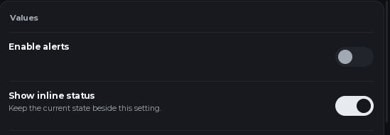
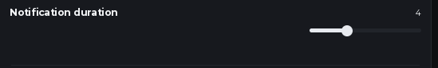
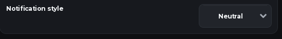

## Create a window

Load the library, create a window, and open a tab. This loader requires a client environment with `loadstring` and `game:HttpGet`.

```lua
local UI = loadstring(game:HttpGet("https://raw.githubusercontent.com/Gabibou455/GabibouUI/main/gabibou_ui.luau"))()
local window = UI:CreateWindow("My project")
local tab = window:Tab("Home", "home")
```

Add controls directly to `tab`. Use a section to group related controls:

```lua
local graphics = tab:Section("Graphics")
graphics:Toggle("Shadows", function(enabled)
    print(enabled)
end)
```

## Choose a control

| Need | Use | Callback value |
| --- | --- | --- |
| Run an action | `Button` | None |
| Turn a setting on or off | `Toggle` | Boolean |
| Choose a number | `Slider` | Number |
| Choose one option | `Dropdown` | String |
| Enter text | `Input` | String, on focus lost |
| Run an action with a key | `Keybind` | Key name, when pressed |
| Choose a color | `ColorPicker` | `#RRGGBB` string |
| Show text | `Paragraph` | None |
| Group controls | `Section` | None |
| Add your own UI | `Custom` | None |

For controls with values, pass the title, optional settings, and callback: `tab:Slider("Volume", {Min = 0, Max = 100}, callback)`. If there are no settings, pass the callback second: `tab:Toggle("Music", callback)`. The older table form remains available: `tab:Toggle({Title = "Music", Value = false, Callback = callback})`.

## Button

**Example**

```lua
tab:Button("Refresh", function()
    print("Refresh the list")
end)
```

**Callback** Runs on click and receives no arguments. The optional settings table supports `Text` for the button caption (default `Run`), `Description`, `Icon`, and `IconVariant`. The title labels the row.

Buttons have no value to read or update.

## Toggle

**Example**

```lua
local shadows = tab:Toggle("Shadows", {Value = false}, function(enabled)
    print("Shadows:", enabled)
end)
```

**Callback** Runs when clicked and receives the new boolean.

<Frame caption="Real component crop from v1.5.0-rc.5: one toggle is off and the other is on.">
  
</Frame>

**Read / update**

```lua
print(shadows:Get())
shadows:Set(true, true) -- true calls the callback if the value changed
```

`Value` sets the starting state and defaults to `false`.

## Slider

**Example**

```lua
local volume = tab:Slider("Music volume", {
    Min = 0,
    Max = 1,
    Step = 0.05,
    Value = 0.5,
}, function(value)
    print("Volume:", value)
end)
```

<Frame caption="Real component crop from v1.5.0-rc.5: the slider displays its current value beside the track.">
  
</Frame>

**Callback** Receives the selected number. Dragging, using the left/right arrow keys, or calling `Set(value, true)` calls it when the value changes.

**Read / update**

```lua
print(volume:Get())
volume:Set(0.75, true)
```

`Min` defaults to `0`, `Max` to `100`, `Step` to `1`, and `Value` to `Min`. Values are clamped to the range and rounded to steps measured from `Min`. For example, `Min = 10` and `Step = 4` gives 10, 14, 18, and so on.

## Dropdown

**Example**

```lua
local quality = tab:Dropdown("Quality", {
    Options = {"Low", "Medium", "High"},
    Value = "Medium",
}, function(choice)
    print("Quality:", choice)
end)
```

<Frame caption="Real component crop from v1.5.0-rc.5: the dropdown shows its current selection.">
  
</Frame>

**Callback** Receives the selected string. `Options` must contain at least one unique, nonempty string. `Value` is optional and must match an option; by default, the first option is selected.

**Read / update**

```lua
print(quality:Get())
quality:Set("High", true)
```

Use `quality:SetOptions({"Low", "High"})` to replace the choices. If the current choice is missing from the new list, the first new option is selected.

## Input

**Example**

```lua
local playerName = tab:Input("Player name", {
    Value = "",
    Placeholder = "Enter a name",
    MaxLength = 24,
}, function(text)
    print("Player name:", text)
end)
```

**Callback** Receives the committed string when the text box loses focus, such as after Enter or a click elsewhere, if the text changed.

**Read / update**

```lua
print(playerName:Get())
playerName:Set("Nova", true)
```

`Value` defaults to an empty string, `Placeholder` to `Type here...`, and `MaxLength` to `120`. `MaxLength` must be from `1` to `4096`; longer text is trimmed to the limit.

## Keybind

**Example**

```lua
local actionKey = tab:Keybind("Action key", {Value = Enum.KeyCode.K}, function(keyName)
    print("Pressed:", keyName)
end)
```

**Callback** Runs when the assigned key is pressed outside key capture. It receives the key name as a string, such as `"K"`. Clicking the key button starts capture; assigning a key during capture updates the value without running the action callback.

**Read / update**

```lua
print(actionKey:Get()) -- "K"
actionKey:Set("J", true) -- assign J and call the callback if it changed
```

`Value` accepts an `Enum.KeyCode` or its name as a string, and defaults to `F6`.

## Color picker

**Example**

```lua
local accent = tab:ColorPicker("Accent color", {
    Value = "#78B8FF",
    Palette = {"#78B8FF", "#A18FFF", "#F08B8B"},
}, function(hex)
    print("Accent:", hex)
end)
```

**Callback** Receives the selected color as a `#RRGGBB` string. The picker supports palette swatches and entering a hex value.

**Read / update**

```lua
print(accent:Get()) -- hex string
print(accent:GetColor()) -- Color3
accent:Set("#A18FFF", true)
```

`Value` accepts a `#RRGGBB` string or `Color3` and defaults to `#F2F4F8`. `Palette` defaults to the built-in palette; a custom palette must contain 1 to 32 hex strings or `Color3` values. The selected value does not need to be in the palette.

## Paragraph

**Example**

```lua
tab:Paragraph("Connection status", {Description = "Connected to the server."})
```

Displays a title and description. Paragraphs have no value or callback.

## Section

**Example**

```lua
local audio = tab:Section("Audio")
audio:Toggle("Music", function(enabled)
    print("Music:", enabled)
end)
```

Pass the section title as a string, or `{Title = "Audio"}`. Add controls to the returned section just as you add them to a tab.

## Custom

**Example**

```lua
local preview = tab:Custom({
    Title = "Preview",
    Height = 48,
    Build = function(content, control, window, options)
        local label = Instance.new("TextLabel")
        label.BackgroundTransparency = 1
        label.Size = UDim2.fromScale(1, 1)
        label.Text = "Preview is ready"
        label.TextColor3 = window.Theme.Text
        label.Parent = content
    end,
})
```

`Custom` takes an options table. `Build` receives `(content, control, window, options)`; parent Roblox UI instances to `content` to show them inside the control. `Height` is the content area's height in pixels; it defaults to `80` and accepts `0` to `2000`. `Build` is optional. Update the height later with `preview:SetHeight(64)`. Custom controls have no stored value or built-in callback.

## Shared options and values

Control settings can include `Description`, `Id`, `Disabled`, and `Layout`. `Desc` is an alias for `Description`. Direct controls receive an ID automatically; declarative controls require `Id`. Give each window a distinct `Id` when showing multiple windows at once.

Value controls (`Toggle`, `Slider`, `Dropdown`, `Input`, `Keybind`, and `ColorPicker`) return a control object. `Get()` reads its current value. `Set(value)` updates it silently; `Set(value, true)` calls the callback only if the value changed. User changes call callbacks automatically, except assigning a key during key capture. Set `Persistent = false` to exclude a value from configuration snapshots.

For saving and restoring values, see [Values and configuration](/customization/values-and-config). For custom components and animation, see [Animations and custom components](/customization/animations-and-components).

Next: [Values and configuration](/customization/values-and-config) · [Events and lifecycle](/customization/events-and-lifecycle)
