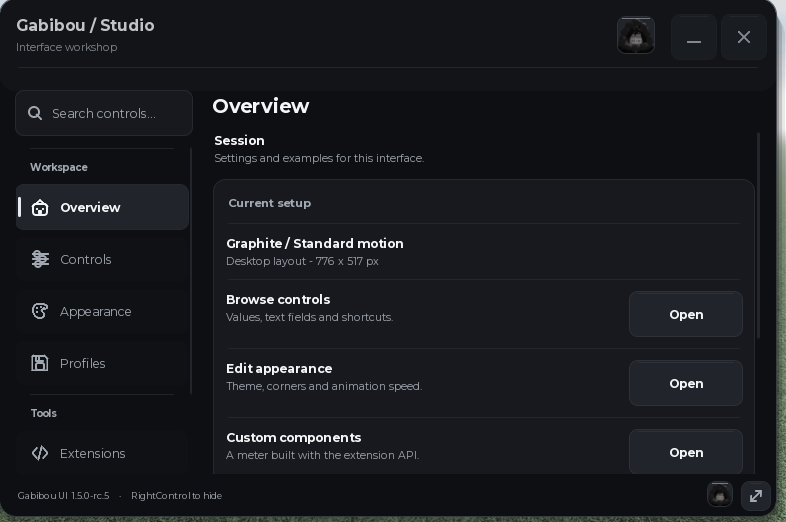

Build a Roblox client interface with a window, tabs, and controls. Start with this short example:

```lua
local UI = loadstring(game:HttpGet('https://raw.githubusercontent.com/Gabibou455/GabibouUI/main/gabibou_ui.luau'))()
local window = UI:CreateWindow('My project')
local tab = window:Tab('Home', 'home')
tab:Button('Say hello', function() print('Hello!') end)
```

<Frame caption="Gabibou UI running in Roblox, with grouped navigation and the Overview page open.">
  
</Frame>

This loader needs a client environment that supports `loadstring` and `game:HttpGet`. For Roblox Studio, use a `ModuleScript`; see [Installation](/getting-started/installation). The `main` URL follows repository updates. Use a published release tag to pin a version.

<CardGroup cols={2}>
  <Card title="Build your first window" icon="rocket" href="/getting-started/quickstart">
    Follow the short setup and learn how control values and callbacks work.
  </Card>
  <Card title="Install the library" icon="download" href="/getting-started/installation">
    Choose the remote loader or a Roblox Studio ModuleScript.
  </Card>
  <Card title="Add controls" icon="sliders" href="/customization/controls">
    Check each control's options and callback value.
  </Card>
  <Card title="Customize the interface" icon="palette" href="/customization/appearance-and-layout">
    Change themes, layout, navigation, and icons.
  </Card>
</CardGroup>

Use [examples](/examples/quickstart) for a complete ModuleScript setup. For key checks, validate access and protected actions on your server; a client UI is not server authentication.
